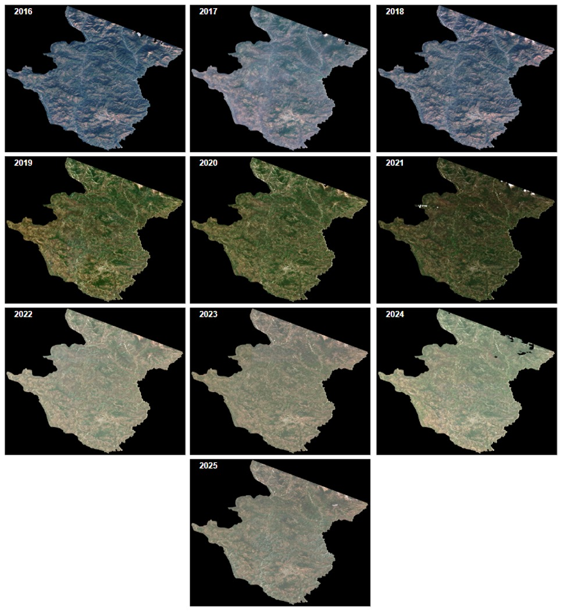
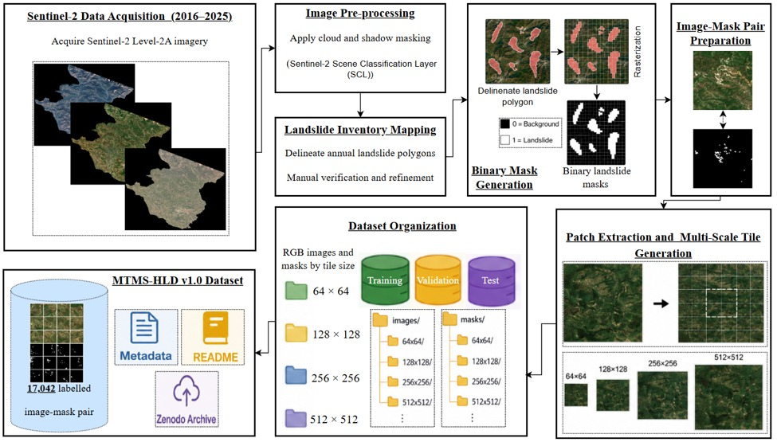

# MTMS-HLD v1.0 (Multi-Temporal Multi-Scale Himalayan Landslide Dataset Version 1.0)

A deep learning framework for **pixel-level landslide detection and semantic segmentation** using Sentinel-2 satellite imagery over the Himalayan region of Uttarakhand, India.

This repository provides the implementation for training, evaluating, and applying semantic segmentation models for landslide mapping using the **MTMS-HLD v1.0 (Multi-Temporal Multi-Scale Himalayan Landslide Dataset Version 1.0)**.

## Overview

Landslides are a major natural hazard in the Himalayan region, where steep terrain, geological conditions, rainfall, and anthropogenic activities contribute to slope instability. Automated landslide mapping from satellite imagery can support rapid assessment, disaster management, and regional-scale hazard monitoring.

This project investigates deep learning-based semantic segmentation for automatic extraction of landslide pixels from Sentinel-2 imagery. The implementation is based on **PyTorch** and the [`segmentation_models.pytorch`](https://github.com/qubvel-org/segmentation_models.pytorch) library.

The framework supports encoder-decoder semantic segmentation architectures and can be adapted to different model architectures and backbone networks.

## MTMS-HLD v1.0 Dataset

The **MTMS-HLD v1.0 (Multi-Temporal Multi-Scale Himalayan Landslide Dataset Version 1.0)** is a standardized landslide segmentation dataset developed from **multi-temporal Sentinel-2 imagery acquired over Pithoragarh district, Uttarakhand, India, between 2016 and 2025**.

The dataset was generated using a semi-automated landslide extraction workflow integrating:

* Spectral indices
* Topographic information
* Morphological processing
* Multi-temporal Sentinel-2 observations
* Manual verification

The resulting annotations were manually verified to generate accurate **pixel-level binary landslide masks**.

### Sentinel-2 Scenes (2016-2025)

<p align="center">
  
</p>

### Dataset Statistics

| Property             | Description                                            |
| -------------------- | ------------------------------------------------------ |
| Dataset              | MTMS-HLD v1.0                                          |
| Full name            | Multi-Temporal Multi-Scale Himalayan Landslide Dataset |
| Study region         | Pithoragarh, Uttarakhand, India                        |
| Data source          | Sentinel-2                                             |
| Temporal coverage    | 2016–2025                                              |
| Annotation type      | Pixel-level binary segmentation masks                  |
| Total paired samples | 17,042                                                 |
| Image scales         | 64×64, 128×128, 256×256, 512×512 pixels                |
| Task                 | Binary semantic segmentation                           |
| Target class         | Landslide                                              |
| Background class     | Non-landslide                                          |

### Multi-Scale Dataset

MTMS-HLD v1.0 contains paired image and annotation-mask samples at four spatial scales:

| Scale     | Number of Patches |
| --------- | ----------------: |
| 64 × 64   |   75944           |
| 128 × 128 |   4731            |
| 256 × 256 |   3041            |
| 512 × 512 |   1679            |
| **Total** |  **17,042**       |

> The scale-wise sample counts will be reported separately once the final dataset distribution is fixed.

## Dataset Organization

The dataset is organized into paired image and mask directories.

```text
dataset/
│
├── images/
│   ├── 64/
│   ├── 128/
│   ├── 256/
│   └── 512/
│
└── masks/
    ├── 64/
    ├── 128/
    ├── 256/
    └── 512/
```

Each image has a corresponding binary segmentation mask.

For example:

```text
images/256/patch_00001.png
masks/256/patch_00001.png
```

where the mask identifies landslide and non-landslide pixels.

## Methodology

The overall workflow consists of the following image:

<p align="center">
  
</p>

## Deep Learning Framework

The segmentation models are implemented using **PyTorch** and the `segmentation_models.pytorch` library.

The library provides multiple encoder-decoder segmentation architectures and pretrained encoders, allowing different combinations of segmentation architectures and backbone networks to be evaluated.

The implementation can be configured for architectures such as:

* UNet
* FCN
* PSPNet
* DeepLab
* DeepLabV3
* DeepLabV3+
* FPNet
* CFNet
* DANet
* ACFNet
* ASPOCRNet
* OCNet

The exact models included in the experiments depend on the configuration used for each experiment.

## Installation

Clone the repository:

```bash
git clone https://github.com/<YOUR-USERNAME>/MTMS-HLD-Landslide-Segmentation.git

cd MTMS-HLD-Landslide-Segmentation
```

Create a virtual environment:

```bash
python -m venv venv
```

Activate the environment.

### Linux/macOS

```bash
source venv/bin/activate
```

### Windows

```bash
venv\Scripts\activate
```

Install the required dependencies:

```bash
pip install -r requirements.txt
```

The primary segmentation dependency is:

```bash
pip install segmentation-models-pytorch
```

## Dataset Preparation

After obtaining access to MTMS-HLD v1.0, organize the dataset according to the directory structure described above.

Before training, verify that:

1. Every image has a corresponding mask.
2. Image and mask dimensions are identical.
3. Masks contain the expected binary labels.
4. Training, validation, and testing samples are separated appropriately.
5. No unintended spatial overlap exists between training and testing samples.

## Training

A typical training command is:

```bash
python scripts/train.py
```

Model configuration can be specified through configuration files:

```bash
python scripts/train.py --config configs/unet_resnet34.yaml
```

The configuration can contain parameters such as:

```yaml
model:
  architecture: Unet
  encoder: resnet34
  encoder_weights: imagenet
  classes: 1

training:
  batch_size: 16
  epochs: 50
  learning_rate: 0.0001

dataset:
  image_size: 256
```

The exact configuration should be adjusted according to the experiment.

## Evaluation

The trained models can be evaluated using standard semantic segmentation metrics, including:

* Intersection over Union (IoU)
* Precision
* Recall
* F1-score

Example:

```bash
python scripts/test.py \
    --model weights/best_model.pth \
    --config configs/unet_resnet34.yaml
```

## Inference

A trained model can be used to generate a landslide prediction mask for an input image:

```bash
python scripts/predict.py \
    --input examples/input/sample.png \
    --weights weights/best_model.pth \
    --output examples/output/prediction.png
```

The output contains the predicted pixel-level landslide segmentation.


## Citation

If you use the MTMS-HLD dataset or this implementation in your research, please cite the associated dataset/research publication:

```bibtex
@dataset{mtms_hld_v1_0,
  title        = {},
  year         = {2026},
  author       = {Naveen Chandra, Himadri Vaidya},
  publisher    = {},
  version      = {1.0},
  description  = {A multi-temporal multi-scale Sentinel-2 landslide
                  segmentation dataset for the Pithoragarh region
                  of Uttarakhand, India.}
}
```


## Acknowledgements

This project uses the [`segmentation_models.pytorch`](https://github.com/qubvel-org/segmentation_models.pytorch) library for semantic segmentation model implementation.

Please cite the original library when using this repository. The library's official package information provides the recommended citation for the project.


For questions regarding the dataset or implementation, please open a GitHub Issue or contact the corresponding author through the contact information provided in the associated research publication.
